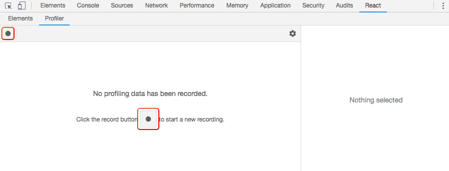
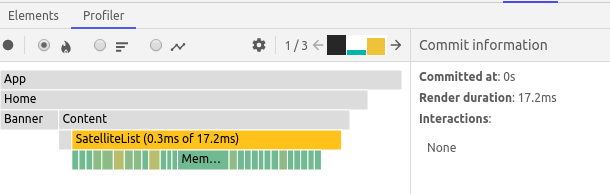
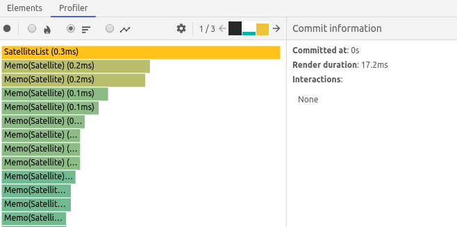

# How to improve performance part II: React


## Introduction

React uses several clever techniques to minimize the number of costly DOM operations required to update the UI. While this will lead to a faster user interface without specifically optimizing for performance for many cases, there are ways where you can still speed up your React application. This post will go over some useful techniques you can use to improve your React code.

## Use React Profiler

The concept of the react profiler is to collect timing information about components, the time rendered and committed in order to identify when each component actually rendered and at what speed. Basically to explain to you how fast or how slow your application is.

### How to use it

Basically, Profiler is a Component that you can extract from the default React package. Since it has a lowercase/underscore name, which a lot of linters frown upon, you’ll need to do one of the following:

```typescript
import React, { unstable_Profiler as Profiler } from 'react';
import ReactDOM from 'react-dom';

const logProfiler = (
  id: string,
  phase: string,
  actualTime: number,
  baseTime: number,
  startTime: number,
  commitTime: number
) => {
  console.log(`<${id}> render time: ${actualTime.toFixed(1)}ms`);
};

ReactDOM.render(
  <Profiler id="App" onRender={logProfiler}>
    <App />
  </Profiler>,
  document.getElementById('root')
);
```

The React Profiler environment is empty at first, you’d also notice a record button. click on it to start profiling.



Once you click on the record button, the profiler automatically collects performance information each time your application renders. To end this, click on the stop button

Then you must see:



The flame chart view represents the state of your application for a particular commit. Each bar in the chart represents a React component. The size and color of the bar represents how long it took to render the component and its children. (The width of a bar represents how much time was spent when the component last rendered and the color represents how much time was spent as part of the current commit.)



The ranked chart view represents a single commit. Each bar in the chart represents a React component. The chart is ordered so that the components which took the longest to render are at the top.

Note that the numbers are relative so components will render faster in production. Still, this should help you realize when unrelated UI gets updated by mistake, and how deep and how often your UI updates occur.

## Why did you render

One of the most common issues that affects performance in React is unnecessary render cycles. By default, React components will re-render whenever their parent renders, even if their props didn’t change.

`why-did-you-render` is a library that hooks into React and detects potentially unnecessary component renders. It detects when a component’s render method is called despite its props not having changed.

### How to use it

Install with npm:

```
npm i -D @welldone-software/why-did-you-render
```

Add this snippet anywhere in your app:

```typescript
if (process.env.NODE_ENV !== 'production') {
  const whyDidYouRender = require('@welldone-software/why-did-you-render');
  whyDidYouRender(React);
}
```

`why-did-you-render` monitors your app as it runs and logs components that may have changed unnecessarily. It lets you see the props before and after a render cycle it determined may have been unnecessary.

## Use function/stateless components and React.PureComponent

In React, function components and PureComponent provide two different ways of optimizing React apps at the component level.
Function components prevent constructing class instances while reducing the overall bundle size as it minifies better than classes.

On the other hand, in order to optimize UI updates, we can consider converting function components to a PureComponent class (or a class with a custom shouldComponentUpdate method). However, if the component doesn’t use state and other life cycle methods, the initial render time is a bit more complicated when compared to function components with potentially faster updates.

React.PureComponent does a shallow comparison on state change. This means it compares values when looking at primitive data types, and compares references for objects. Due to this, we must make sure two criteria are met when using React.PureComponent:

- Component State/Props is an immutable object.
- State/Props should not have a multi-level nested object.

## Use React Fragments to avoid additional HTML element wrappers

React Fragments lets you group a list of children without adding an extra node.

```typescript
const Home: React.FC<IProps> = ({ satellites }) => {
  // ...

  return (
    <>
      <Banner>Ad Astra</Banner>
      <React.Suspense fallback={<Spinner />}>
        <Satellites satellites={satellites} />
      </React.Suspense>
    </>
  );
};
```

## Memoize React Components

Memoization is an optimization technique used primarily to speed up computer programs by storing the results of expensive function calls and returning the cached result when the same inputs occur again. A memoized function is usually faster because if the function is called with the same values as the previous one then instead of executing function logic it would fetch the result from cache.

In React, this method will do a shallow equal comparison of both props and context of the component based on strict equality.

```typescript
const Satellite: React.FC<IProps> = ({ satellite }) => (
  <div className="satellite">
    <div className="satellite-name">
      
      <p className="satellite__name">{satellite.name}</p>
    </div>
    <div className="satellite-info">
      <p className="satellite-info__location">{satellite.location}</p>
      <p className="satellite-info__updated">{satellite.lastUpdated}</p>
    </div>
  </div>
);

export default React.memo(Satellite);
```

## Memoizing functions

We can use `useCallback` hook to memoize our callback that we pass through the props.

`useCallback` hook returns a memoized version of our function that only changes if one of the dependencies have changed. In other words, our function will never be recreated unless the state value has changed.

```typescript
const App: React.FC = () => {
  const [value, setValue] = useState('');

  const addHello = useCallback(() => setValue(value + 'Hello!'), [value]);

  return (
    <div>
      <input
        type="text"
        onChange={e => setValue(e.target.value)}
        value={value}
      />
      <Counter addHello={addHello} myObject={{ key: 'value' }} />
    </div>
  );
};
```

## Memoizing objects

`useMemo` hook let you memoize a value (including objects) by passing a "create" function and an array of dependencies. The value will only recompute when one of the dependencies has changed (just like useCallback hook).

```typescript
const App: React.FC = () => {
  const [value, setValue] = useState('');
  const [newValue, setNewValue] = useState('');

  const addHello = useCallback(() => setValue(value + 'Hello!'), [value]);
  const myObject = useMemo(() => ({ key: 'value' }), []);

  return (
    <div>
      <input
        type="text"
        onChange={e => setValue(e.target.value)}
        value={value}
      />
      <input
        type="text"
        onChange={e => setNewValue(e.target.value)}
        value={newValue}
      />
      <Counter addHello={addHello} myObject={myObject} />
    </div>
  );
};
```

## Code splitting

Bundling is great, but as your app grows, your bundle will grow too. Especially if you are including large third-party libraries. You need to keep an eye on the code you are including in your bundle so that you don’t accidentally make it so large that your app takes a long time to load.

To avoid winding up with a large bundle, it’s good to get ahead of the problem and start “splitting” your bundle. Code-Splitting is a feature supported by bundlers like Webpack and which can create multiple bundles that can be dynamically loaded at runtime.

Code-splitting your app can help you “lazy-load” just the things that are currently needed by the user, which can dramatically improve the performance of your app. While you haven’t reduced the overall amount of code in your app, you’ve avoided loading code that the user may never need, and reduced the amount of code needed during the initial load.

### Using React.lazy and React.Suspense

```typescript
const Satellites = React.lazy(() =>
  import(/* webpackChunkName: "Satellites" */ '../Content')
);

const Home: React.FC<IProps> = ({ satellites }) => {
  // ...

  return (
    <>
      <Banner>Ad Astra</Banner>
      <React.Suspense fallback={<Spinner />}>
        <Satellites satellites={satellites} />
      </React.Suspense>
    </>
  );
};
```

## Using web workers for CPU extensive tasks

Web workers makes it possible to run a script operation in a web application’s background thread, separate from the main execution thread. By performing the laborious processing in a separate thread, the main thread, which is usually the UI, is able to run without being blocked or slowed down.
Web Workers works best when executing computation extensive operation since it executes code independent of other scripts in a separate thread in the background. This means it doesn’t affect the page’s performance.

To get started, install `worker-loader`:

```
npm i -D worker-loader
```

Here’s a code without using Web Workers with Typescript:

```typescript
// custom.d.ts
declare module 'worker-loader!*' {
  class WebpackWorker extends Worker {
    constructor();
  }

  export default WebpackWorker;
}
```

```typescript
// worker.ts
const ctx: Worker = self as any;

ctx.onmessage = e => {
  const satellites = e.data;
  satellites.sort((a: any, b: any) => {
    if (a.name < b.name) {
      return -1;
    }
    if (a.name > b.name) {
      return 1;
    }
    return 0;
  });
  ctx.postMessage(satellites);
};
```

```typescript
// index.tsx
import React, { useState, useEffect } from 'react';
import Worker from 'worker-loader!./worker';
import { ISatellite } from '../../types/Satellite';
import Satellite from '../Satellite';

interface IProps {
  satellites: ISatellite[];
}

const SatelliteList: React.FC<IProps> = ({ satellites }) => {
  const [activeSatellites, setSatellites] = useState([]);

  useEffect(() => {
    const worker = new Worker();
    worker.onmessage = (ev: MessageEvent) => {
      setSatellites(ev.data);
      worker.terminate();
    };
    worker.postMessage(satellites);
  }, [satellites]);

  return (
    <div className="grid">
      {activeSatellites.map((satellite: ISatellite) => (
        <Satellite key={satellite.id} satellite={satellite} />
      ))}
    </div>
  );
};

export default SatelliteList;
```

## Virtualize long lists

List virtualization, or windowing, is a technique to improve performance when rendering a long list of data. This technique only renders a small subset of rows at any given time and can dramatically reduce the time it takes to re-render the components, as well as the number of DOM nodes created.

There are some popular React libraries out there, like `react-window` and `react-virtualized`, which provides several reusable components for displaying lists, grids, and tabular data.

## Throttling and Debouncing Event Action in JavaScript

Throttling means delaying function execution. So instead of executing the event handler/function immediately, you’ll be adding a few milliseconds of delay when an event is triggered. This can be used when implementing infinite scrolling, for example.

It can be implemented a number of ways. You can throttle by the number of events triggered or by the delay event handler being executed.

Unlike throttling, debouncing is a technique to prevent the event trigger from being fired too often. If you are using lodash, you can wrap the function you want to call in lodash’s debounce function.

## Optimizing Redux

### Using immutable data structures

Data immutability, which comes from the functional programming world, can be applied to the design of front-end apps. It can have many benefits, such as:

- Zero side-effects.
- Immutable data objects are simpler to create, test, and use.
- Helps prevent temporal coupling;
- Easier to track changes.

#### Using immer

`immer` is a tiny package that allows you to work with immutable state in a more convenient way. It is based on the `copy-on-write` mechanism.

The basic idea is that you will apply all your changes to a temporarily draftState, which is a proxy of the currentState. Once all your mutations are completed, Immer will produce the nextState based on the mutations to the draft state. This means that you can interact with your data by simply modifying it while keeping all the benefits of immutable data.

```typescript
import { produce } from 'immer';

export const satelliteReducer = (
  state: IState = initialState,
  action: ReduxAction
): IState => {
  return produce(state, draft => {
    switch (action.type) {
      case getType(actions.upsertSatellite): {
        const satellite = action.payload.satellite;
        draft.satellites = satellite;
        break;
      }
      default:
        return state;
    }
  });
};
```

### Memoize selectors

Reselect is a simple selector library for Redux, which can be used for building memorized selectors. You can define selectors as a function, retrieving snippets of the Redux state for React components.

```typescript
import { createSelector } from 'reselect';

// ...

const getSatellites = (state: ReduxState): ISatellite[] => state.satellites;

export const getActiveSatellites = createSelector(
  getSatellites,
  satellites => {
    return satellites.filter(satellite => satellite.isActive);
  }
);
```

## Conclusion

There are many ways to optimize a React app, for example lazy loading components, using ServiceWorkers to cache application state, considering SSR, avoiding unnecessary renders etc.. That said, before considering optimization, it’s worth understanding how React components work, understanding diffing algorithms, and how rendering works in React. These are all important concepts to take into consideration when optimizing your application.
