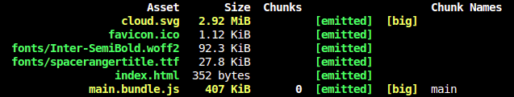
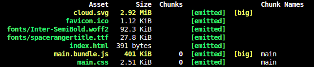
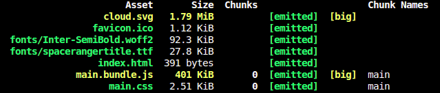

# How to improve performance in web applications part I: Webpack


## Introduction

In this article, we’ll cover some easy Webpack techniques that will serve your app faster to users, no matter what you’re using. In [this](https://github.com/seb7887/react-performance) sample app, starting from no optimization, we were able to compress our entry JS and implement intelligent caching for faster refreshes.

Our starting point is this:



## Styling

### Extracting CSS

By default, all CSS is inlined to JavaScript. Even though this can be convenient during development, it doesn't sound ideal in production.

Separating CSS to a file of its own avoids the problem by letting the browser to manage it separately.

It can be possible to generate a separate CSS bundle using `mini-css-extract-plugin`. It can aggregate multiple CSS files into one. For this reason, it comes with a loader that handles the extraction process. The plugin then picks up the result aggregated by the loader and emits a separate file.
To set it up, you must install the plugin first:

```
npm i -D mini-css-extract-plugin
```

Then add to your configuration:

```javascript
const merge = require('webpack-merge');
const MiniCssExtractPlugin = require('mini-css-extract-webpack-plugin');

const ExtractCss = ({ include, exclude, use = [] }) => {
  const plugin = new MiniCssExtractPlugin({
    filename: '[name].css'
  });

  return {
    module: {
      rules: [
        {
          test: /\.scss$/,
          include,
          exclude,
          use: [MiniCssExtractPlugin.loader].concat(use)
        }
      ]
    },
    plugins: [plugin]
  };
};

module.exports = merge([
  // ...
  ExtractCss({
    use: ['css-loader', 'fast-sass-loader']
  })
]);
```

### Enabling PurifyCSS

Typically, you bundle even the unused CSS. It's possible to eliminate all unused CSS.
`PurifyCSS` is a tool that can achieve this by analyzing files. It takes content and CSS and returns only the used CSS. PurifyCSS does not modify the original CSS files.

`purifycss-webpack` allows to achieve similar results. You should use the `MiniCssExtractPlugin` with it for the best results. Install it and a glob helper first:

```
npm i -D glob purifycss-webpack purify-css
```

You also need PurifyCSS configuration as below:

```javascript
const path = require('path');
const merge = require('webpack-merge');
const PurifyCssPlugin = require('purifycss-webpack');

const purifyCss = ({ paths }) => ({
  plugins: [
    new PurifyCssPlugin({
      paths,
      minimize: true
    })
  ]
});

module.exports = merge([
  // ...
  purifyCss({
    paths: glob.sync(`${path.join(__dirname, './src')}/**/*.tsx`, {
      nodir: true
    })
  })
]);
```

### Autoprefixing

It can be challenging to remember which vendor prefixes you have to use for specific CSS rules to support a large variety of users. `Autoprefixer` solves this problem. It is a `PostCSS` plugin to parse CSS and add vendor prefixes to CSS rules using values from [Can I Use](https://caniuse.com/).

Achieving autoprefixing takes a small addition to the current setup. Install `postcss-loader` and `autoprefixer` first:

```
npm i -D postcss-loader autoprefixer
```

Add this to enabling autoprefixing:

```javascript
const merge = require('webpack-merge');

const autoprefix = () => ({
  loader: 'postcss-loader',
  options: {
    plugins: () => [require('autoprefixer')()]
  }
});

module.exports = merge([
  // ...
  ExtractCss({
    use: ['css-loader', autoprefix(), 'fast-sass-loader']
  })
]);
```

Now our build looks like this:



## Assets

### Optimizing images

In case you want to compress your images, use `image-webpack-loader`. This type of loader should be applied first to the data, so remember to place it as the last within use listing.

Compression is particularly valuable for production builds as it decreases the amount of bandwidth required to download your image assets and speed up your site or application as a result.

```
npm i -D image-webpack-loader
```

Then add:

```javascript
const merge = require('webpack-merge');

const loadSvg = ({ include, exclude, options } = {}) => ({
  module: {
    rules: [
      {
        test: /\.svg$/,
        include,
        exclude,
        use: [
          {
            loader: 'file-loader',
            options
          },
          {
            loader: 'image-webpack-loader'
          }
        ]
      }
    ]
  }
});

module.exports = merge([
  // ...
  loadSvg({
    options: {
      limit: 15000,
      name: '[name].[ext]'
    }
  })
]);
```

Let’s see how that affects our build:


## Bundle Optimization

### Bundle Splitting

With bundle splitting, you can push the vendor dependencies to a separate bundle and benefit from client level caching. The process can be done in such a way that the whole size of the application remains the same. Although there are more requests to perform, the benefit of caching makes up for this cost.

```javascript
const merge = require('webpack-merge');

module.exports = merge([
  // ...
  {
    optimization: {
      splitChunks: {
        cacheGroups: {
          commons: {
            test: /[\\/]node_modules[\\/]/,
            name: 'vendor',
            chunks: 'all'
          }
        }
      }
    }
  }
]);
```

### Minifying Javascript

The goal of minification is to convert the code into a smaller form without losing any meaning by rewriting code. In Webpack 4, the minification process is controlled through two configuration fields: optimization.minimize flag to enable it and optimization.minimizer array to configure the process.

To tune the defaults, we'll attach `terser-webpack-plugin` to the project so that it's possible to adjust it.

To get started, include the plugin to the project:

```
npm i -D terser-webpack-plugin
```

Then attach it to the configuration:

```javascript
const merge = require('webpack-merge');
const TerserPlugin = require('terser-webpack-plugin');

const minifyJavascript = () => ({
  optimization: {
    minimizer: [new TerserPlugin({ sourceMap: true })]
  }
});

module.exports = merge([
  // ...
  minifyJavascript()
]);
```

### Scope hoisting

Webpack 4 applies scope hoisting in production mode by default, hoisting all modules to a single scope instead of writing a separate closure for each. Doing this slows down the build but gives you bundles that are faster to execute.

```javascript
const merge = require('webpack-merge');
const webpack = require('webpack');

const moduleConcatenation = () => ({
  plugins: [new webpack.optimize.ModuleConcatenationPlugin()]
});

module.exports = merge([
  // ...
  moduleConcatenation()
]);
```

### Minifying CSS

`optimize-css-assets-webpack-plugin` is a plugin bis a plugin that searches for CSS assets during the Webpack build and optimizes \ minimizes the CSS (by default it uses `cssnano` but a custom CSS processor can be specified). Using `MiniCssExtractPlugin` can lead to duplicated CSS given it only merges text chunks. `OptimizeCSSAssetsPlugin` avoids this problem by operating on the generated result and thus can lead to a better result.

To attach it to the setup, install it and `cssnano` first:

```
npm i -D optimize-css-assets-webpack-plugin cssnano
```

And then:

```javascript
const merge = require('webpack-merge');
const OptimizeCssAssetsPlugin = require('optimize-css-assets-webpack-plugin');
const cssnano = require('cssnano');

const minifyCss = ({ options }) => ({
  plugins: [
    new OptimizeCssAssetsPlugin({
      cssProcessor: cssnano,
      cssProcessorOptions: options,
      canPrint: false
    })
  ]
});

module.exports = merge([
  // ...
  minifyCss({
    options: {
      discardComments: {
        removeAll: true
      },
      // Run cssnano in safe mode to avoid potentially unsafe transformations
      safe: true
    }
  })
]);
```

### Three Shaking

We often use named imports on files that have a lot of other exports. It might create a case in which we don’t import all the things, but Webpack would include a whole module anyway. This is where tree shaking comes in handy because it can help eliminate this dead code for us. Thanks to that, our bundle size can decrease greatly.

```javascript
const merge = require('webpack-merge');

module.exports = merge([
  // ...
  {
    optimization: {
      splitChunks: {
        cacheGroups: {
          commons: {
            test: /[\\/]node_modules[\\/]/,
            name: 'vendor',
            chunks: 'all'
          }
        }
      },
      usedExports: true,
      sideEffects: true
    }
  }
]);
```

### Adding hashes to filenames

Although the generated build works the file names it uses is problematic, it doesn't allow to boost client level cache efficiently as there's no way to tell whether or not a file has changed. Cache invalidation can be achieved by including a hash to the filenames.

Webpack provides placeholders for this purpose. These strings are used to attach specific information to webpack output. The most valuable ones are:

- `[id]` - Returns the chunk id.
- `[path]` - Returns the file path.
- `[name]` - Returns the file name.
- `[ext]` - Returns the extension. `[ext]` works for most available fields. `MiniCssExtractPlugin` is a notable exception to this rule.
- `[hash]` - Returns the build hash. If any portion of the build changes, this changes as well.
- `[chunkhash]` - Returns an entry chunk-specific hash. Each entry defined in the configuration receives a hash of its own. If any portion of the entry changes, the hash will change as well.
- `[contenthash]` - Returns a hash generated based on content.

It's preferable to use particularly hash and chunkhash only for production purposes as hashing doesn't do much good during development.

Images and fonts should receive hash while chunks should use chunkhash in their names to invalidate them correctly:

```javascript
const path = require('path');
const merge = require('webpack-merge');
const MiniCssExtractPlugin = require('mini-css-extract-webpack-plugin');

const ExtractCss = ({ include, exclude, use = [] }) => {
  const plugin = new MiniCssExtractPlugin({
    filename: '[name].[contenthash:4].css'
  });

  return {
    module: {
      rules: [
        {
          test: /\.scss$/,
          include,
          exclude,
          use: [MiniCssExtractPlugin.loader].concat(use)
        }
      ]
    },
    plugins: [plugin]
  };
};

const loadFonts = ({ include, exclude, options } = {}) => ({
  module: {
    rules: [
      {
        test: /\.(eot|webp|ttf|woff|woff2)$/,
        use: {
          loader: 'file-loader',
          options: {
            name: 'fonts/[name].[hash:4].[ext]'
          }
        }
      }
    ]
  }
});

// ...

module.exports = merge([
  // ...
  {
    output: {
      path: path.join(__dirname, './dist'),
      chunkFilename: '[name].[chunkhash:4].js',
      filename: '[name].[chunkhash:4].bundle.js'
    }
  },
  ExtractCss({
    use: ['css-loader', 'fast-sass-loader']
  }),
  loadSvg({
    options: {
      limit: 15000,
      name: '[name].[hash:4].[ext]'
    }
  }),
  loadFonts()
]);
```

### Extracting a Manifest

When Webpack writes bundles, it maintains a manifest as well. The manifest describes what files Webpack should load. It's possible to extract it and start loading the files of the project faster instead of having to wait for the vendor bundle to be loaded.

If the hashes Webpack generates change, then the manifest changes as well. As a result, the contents of the vendor bundle change, and become invalidated. The problem can be eliminated by extracting the manifest to a file of its own or by writing it inline to the HTML of the project.

To extract the manifest and inline it to the HTML, install this:

```
npm i -D inline-manifest-webpack-plugin
```

And then add this to your configuration:

```javascript
const merge = require('webpack-merge');
const InlineManifestWebpackPlugin = require('inline-manifest-webpack-plugin');

const inlineManifest = ({ name }) => ({
  plugins: [new InlineManifestWebpackPlugin(name)]
});

module.exports = merge([
  // ...
  {
    optimization: {
      splitChunks: {
        cacheGroups: {
          commons: {
            test: /[\\/]node_modules[\\/]/,
            name: 'vendor',
            chunks: 'all'
          }
        }
      },
      runtimeChunk: {
        name: 'manifest'
      },
      usedExports: true,
      sideEffects: true
    }
  },
  inlineManifest({ name: 'manifest' })
]);
```

## Conclusion

Our build now looks better:


Hopefully, with all these techniques you are able to significantly cut the bundle size and improve performance.
